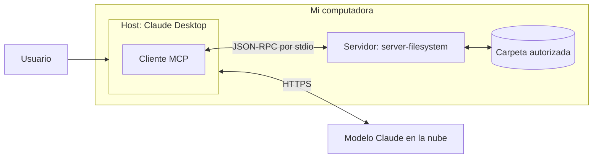

# 4. Arquitectura de MCP

> **Versión de la especificación consultada:** MCP **2026-07-28** (la más reciente publicada en
> https://modelcontextprotocol.io/specification/latest al 15 de septiembre de 2026).
> La especificación cambia seguido; todo lo de este documento se refiere a esa versión.

## Un protocolo abierto

MCP fue presentado por Anthropic el 25 de noviembre de 2024 como un estándar abierto para
conectar asistentes de IA con los sistemas donde viven los datos (Anthropic, 2024). El 9 de
diciembre de 2025, Anthropic lo donó a la **Agentic AI Foundation (AAIF)**, una fundación
dentro de la Linux Foundation, cuyos miembros incluyen a AWS, Google, Microsoft y OpenAI, entre
otros (Linux Foundation, 2025). O sea: no es una tecnología de un solo proveedor, lo usan y lo
mantienen varias empresas, y lo implementan clientes como Claude, VS Code, Cursor o Google
Antigravity.

Los mensajes usan **JSON-RPC 2.0**.

## Modelo host / cliente / servidor

| Rol | Qué hace | En mi implementación |
|---|---|---|
| **Host** | La aplicación de IA que usa el usuario. Crea y coordina a los clientes, aplica las políticas de seguridad y pide el consentimiento del usuario. | **Claude Desktop** |
| **Cliente** | Un conector que vive *dentro* del host. Cada cliente habla con **exactamente un** servidor (relación 1:1). | La conexión que Claude Desktop crea para el servidor `filesystem` |
| **Servidor** | Programa que expone capacidades (herramientas, recursos, prompts). Puede ser un proceso local o un servicio remoto. | `@modelcontextprotocol/server-filesystem`, corriendo como proceso hijo con `npx` |

La especificación define estos tres roles y aclara que un host puede tener varios clientes, cada
uno conectado a un servidor distinto (Model Context Protocol, 2026b). Un detalle de diseño que
me pareció importante: **los servidores no pueden leer toda la conversación ni "ver" a los otros
servidores**; el historial completo se queda en el host.

Y algo que es fácil confundir: **el modelo no es ninguno de los tres**. El modelo (Claude) corre
en los servidores de Anthropic. El host le pasa la lista de herramientas, el modelo decide cuál
usar, y el host, a través del cliente, se lo pide al servidor. **Quien toca el disco es el
servidor MCP, no el modelo.**



## Primitivas que expone un servidor

Un servidor puede ofrecer tres tipos de cosas (Model Context Protocol, 2026c):

| Primitiva | ¿Quién la controla? | Para qué sirve | Ejemplo |
|---|---|---|---|
| **Tools** (herramientas) | El **modelo** | Funciones que el modelo decide ejecutar para hacer una acción u obtener información | `write_file`, hacer un POST a una API |
| **Resources** (recursos) | La **aplicación** | Datos o contenido que el cliente adjunta como contexto | Contenido de un archivo, historial de git |
| **Prompts** (plantillas de prompt) | El **usuario** | Plantillas o flujos predefinidos que el usuario elige | Un comando tipo `/revisar-codigo` |

Es importante no quedarse solo con las herramientas: los recursos y los prompts también son
parte del protocolo. Un servidor no está obligado a ofrecer las tres; por ejemplo, el servidor
de sistema de archivos que instalé solo expone herramientas (ver
[El servidor de sistema de archivos](05-servidor-filesystem.md)).

## Primitivas del lado del cliente

El cliente también puede ofrecerle cosas al servidor:

- **Elicitation:** el servidor le pide al usuario, a través del cliente, información adicional
  durante una operación. Tiene dos modos: *form* (un formulario con esquema) y *url* (manda al
  usuario a una página externa, para datos sensibles como contraseñas, que nunca deben pedirse
  por formulario) (Model Context Protocol, 2026d).
- **Roots:** el cliente le indica al servidor qué directorios o archivos considera relevantes
  (por ejemplo, la carpeta del proyecto). El servidor de sistema de archivos puede usarlos para
  saber qué carpetas tiene permitidas. **Ojo:** en la versión 2026-07-28, Roots aparece como
  **deprecated** (SEP-2577); sigue en la especificación al menos doce meses, pero se recomienda
  pasar los directorios por configuración del servidor o por parámetros (Model Context Protocol,
  2026e).
- **Sampling:** permitía que el servidor le pidiera al modelo del cliente generar texto. También
  quedó deprecated en 2026-07-28 (Model Context Protocol, 2026e).

## Transportes

El protocolo es el mismo sin importar por dónde viajen los mensajes. La especificación define
dos transportes estándar (Model Context Protocol, 2026f):

| Transporte | Cómo funciona | Cuándo se usa |
|---|---|---|
| **stdio** | El cliente lanza al servidor como **proceso hijo** y se comunican por la entrada/salida estándar, un mensaje JSON-RPC por línea | Servidores **locales**. Es el que uso: Claude Desktop ejecuta `npx ... server-filesystem` |
| **Streamable HTTP** | Cada mensaje es un HTTP POST a un único endpoint MCP; la respuesta llega como JSON o como un flujo SSE | Servidores **remotos** (en internet o en otro equipo) |

El transporte anterior "HTTP+SSE" está deprecated desde la versión 2025-03-26 y fue reemplazado
por Streamable HTTP.

## Cambio importante en 2026-07-28

Las versiones anteriores iniciaban la conexión con un saludo `initialize` y mantenían una sesión.
En 2026-07-28 el protocolo pasó a ser **sin estado**: cada petición lleva su versión y las
capacidades del cliente en el campo `_meta`, y el cliente puede descubrir las capacidades del
servidor con `server/discover` (Model Context Protocol, 2026b).

## Ejemplo de mensajes

Así descubre el cliente las herramientas (`tools/list`) y así invoca una (`tools/call`). Son
ejemplos simplificados de la especificación, adaptados a una herramienta del servidor de
archivos:

```json
{ "jsonrpc": "2.0", "id": 1, "method": "tools/list" }
```

```json
{
  "jsonrpc": "2.0",
  "id": 2,
  "method": "tools/call",
  "params": {
    "name": "list_directory",
    "arguments": { "path": "C:\\ruta\\espacio-trabajo" }
  }
}
```

## Fuentes

- Anthropic. (2024, 25 de noviembre). *Introducing the Model Context Protocol*. https://www.anthropic.com/news/model-context-protocol
- Linux Foundation. (2025, 9 de diciembre). *Linux Foundation announces the formation of the Agentic AI Foundation (AAIF), anchored by new project contributions including Model Context Protocol (MCP), goose and AGENTS.md*. https://www.linuxfoundation.org/press/linux-foundation-announces-the-formation-of-the-agentic-ai-foundation
- Model Context Protocol. (2026b). *Architecture* (versión 2026-07-28). https://modelcontextprotocol.io/specification/2026-07-28/architecture
- Model Context Protocol. (2026c). *Server features: Overview* (versión 2026-07-28). https://modelcontextprotocol.io/specification/2026-07-28/server
- Model Context Protocol. (2026d). *Elicitation* (versión 2026-07-28). https://modelcontextprotocol.io/specification/2026-07-28/client/elicitation
- Model Context Protocol. (2026e). *Deprecated features* (versión 2026-07-28). https://modelcontextprotocol.io/specification/2026-07-28/deprecated
- Model Context Protocol. (2026f). *Transports* (versión 2026-07-28). https://modelcontextprotocol.io/specification/2026-07-28/basic/transports
